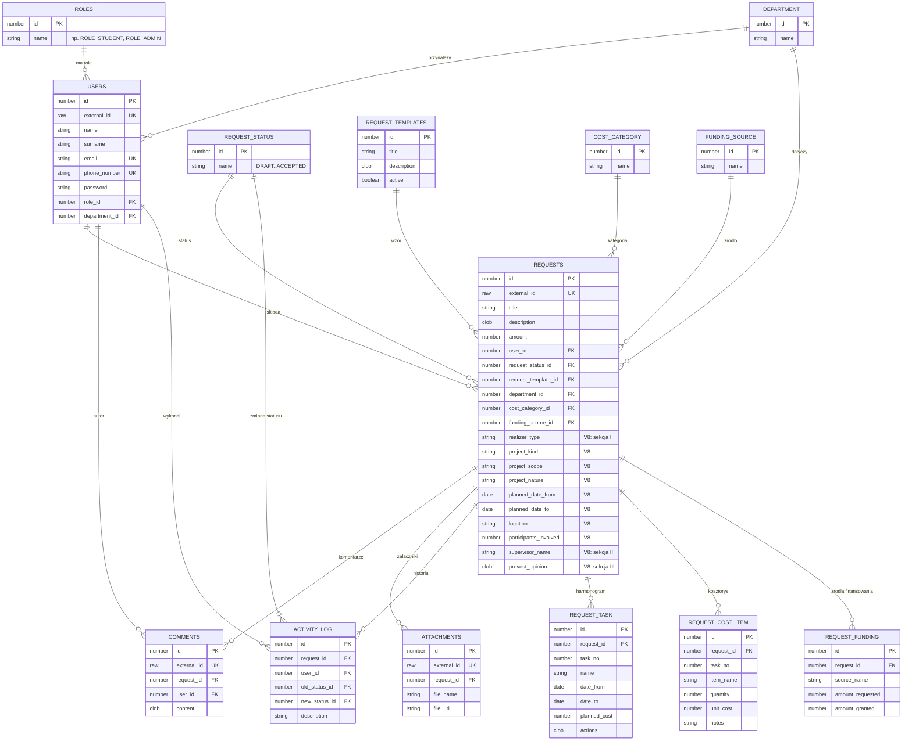

# Diagram encji (ERD) — Finansista PB

Schemat bazy danych po migracjach V1–V8 (Oracle).
Renderuje się na GitHubie oraz w podglądzie Mermaid (IntelliJ / VS Code).

## Legenda

- `PK` — klucz główny, `FK` — klucz obcy, `UK` — unikalny.
- `||--o{` — relacja jeden-do-wielu (jeden rekord po lewej, wiele po prawej).
- Hybrydowy klucz: wewnętrzny `id` (NUMBER IDENTITY) + zewnętrzny `external_id` (RAW(16)/UUID) wystawiany na zewnątrz w API i adresach URL.
- Kolumny oznaczone `V8` dodano przy odwzorowaniu Załącznika nr 1 (sekcje I–III); tabele `REQUEST_TASK`, `REQUEST_COST_ITEM`, `REQUEST_FUNDING` to sekcje IV i VI.
- Tabele słownikowe (ROLES, DEPARTMENT, REQUEST_STATUS, COST_CATEGORY, FUNDING_SOURCE, REQUEST_TEMPLATES) wypełnia migracja V2.
